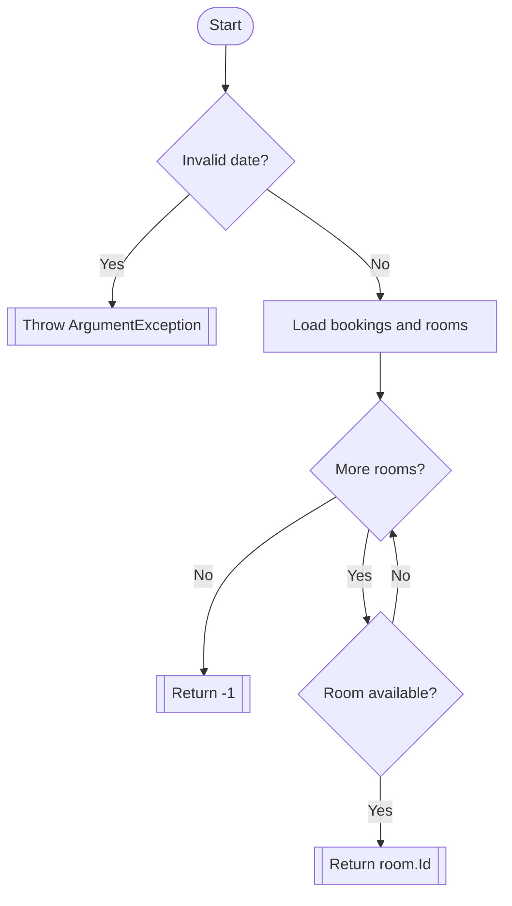
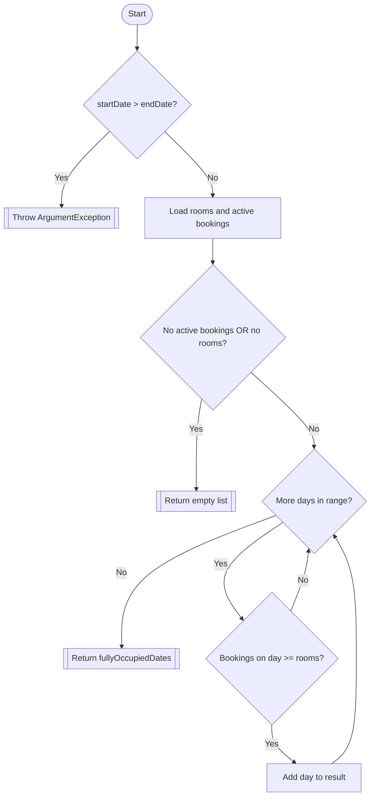

# White-box Analysis - BookingManager

This document analyzes `FindAvailableRoom` and `GetFullyOccupiedDates` from `HotelBooking.Core/Services/BookingManager.cs`.

## Method 1: `FindAvailableRoom(DateTime startDate, DateTime endDate)`

## Control-flow intent
1. Validate input dates.
2. Load active bookings and rooms.
3. For each room, check if requested range overlaps any active booking for that room.
4. Return first available room id; otherwise `-1`.

## Predicate points
- `if (startDate <= DateTime.Today || startDate > endDate)`
- `foreach (var room in rooms)`
- `if (roomIsAvailable)`

## Cyclomatic complexity
Using predicate count + 1:

- Predicates = 3
- Cyclomatic complexity = 3 + 1 = **4**

Using graph formula `E - N + 2` on the DD-path graph below also yields **4**.

## DD-path graph (Mermaid)

## Independent basis paths
1. `Start -> Invalid date -> Throw`
2. `Start -> Valid -> No rooms available in loop -> Return -1`
3. `Start -> Valid -> First checked room available -> Return room.Id`
4. `Start -> Valid -> First room unavailable -> later room available or loop end`

---

## Method 2: `GetFullyOccupiedDates(DateTime startDate, DateTime endDate)`

## Control-flow intent
1. Validate range.
2. Load room count and active bookings.
3. If no active bookings or no rooms, return empty list.
4. Iterate each day in range; if bookings on that day cover all rooms, add day to result.

## Predicate points
- `if (startDate > endDate)`
- `if (!activeBookings.Any() || numberOfRooms == 0)`
- `for (DateTime currentDate = startDate; currentDate <= endDate; ...)`
- `if (activeBookingsOnDate >= numberOfRooms)`

## Cyclomatic complexity
Using predicate count + 1:

- Predicates = 4
- Cyclomatic complexity = 4 + 1 = **5**

Using graph formula `E - N + 2` on the DD-path graph below also yields **5**.

## DD-path graph (Mermaid)

## Independent basis paths
1. Invalid input -> throw.
2. Valid input but no active bookings/no rooms -> empty list.
3. Valid input -> loop executes -> condition false for day(s) -> return list.
4. Valid input -> loop executes -> condition true at least once -> return populated list.
5. Valid input -> mix of true/false days in loop -> return list.

## Coverage mapping
- **Statement coverage**: run tests that hit throw paths, empty-return path, and loop body path.
- **Branch coverage**: force both outcomes for each `if` and loop decision.
- **Path coverage**: execute independent basis paths above (minimum set guided by complexity).

